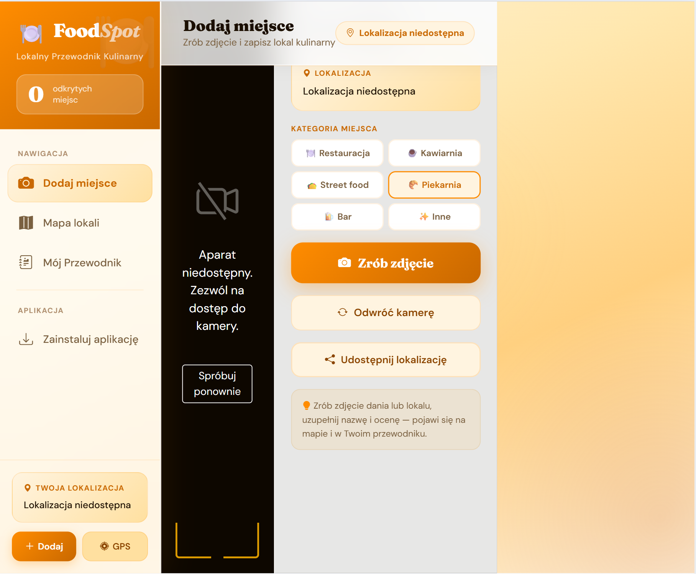

# PWA-project

# 🚀 FoodCatcher – Discover & Track Your Favorite Places

FoodCatcher is a web application designed to help users discover, document, and revisit their favorite food-related places. Whether it's a restaurant, café, bakery, bar, or street food spot, users can easily capture and organize their experiences in one place.

---

## 📝 Description

The application allows users to take photos of places they visit and enrich them with additional information such as location, category, rating, and personal comments. Each entry becomes part of a personalized collection of discovered places.

Users can categorize locations into different types, including:
- 🍽️ Restaurants  
- ☕ Cafés  
- 🍞 Bakeries  
- 🍔 Street food  
- 🍹 Bars  

Each saved place is automatically linked with its geographic location and displayed on an interactive map.

---

## 🚀 Features

- 📸 Capture and upload photos of visited places  
- 📍 Automatically assign and display location on a map  
- 🗂️ Categorize places (restaurant, café, bakery, bar, street food)  
- ⭐ Add ratings and personal reviews  
- 🗺️ Interactive map with all saved locations  
- 📖 “My Guide” – a personal list of visited places  
- 🔢 Counter of discovered locations  

---

## 🖼️ Preview

---

## 👥 Authors

| Name and Surname   | Student ID | Academic group |
|:------------------:|:----------:|:--------------:|
| Olena Zhylenkova   | 231648     | ZIISS1-3612IO  |
| Solomiia Titova    | 231346     | ZIISS1-3612IO  |
| Magdalena Wachowska| 232483     | ZIISS1-3612IO  |
